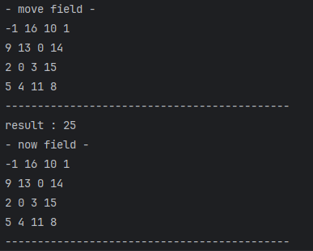

```java
package BackTracking;

import java.io.*;
import java.util.*;

public class TeenagerShark {
    static int result;
    static int[] dy = {0, -1, -1, 0, 1, 1, 1, 0, -1}; // index: 0인 경우 상어에게 먹힘
    static int[] dx = {0, 0, -1, -1, -1, 0, 1, 1, 1}; // index: 0인 경우 상어에게 먹힘

    public static void main(String[] args) throws IOException {
        BufferedReader br = new BufferedReader(new InputStreamReader(System.in));
        BufferedWriter bw = new BufferedWriter(new OutputStreamWriter(System.out));

        /* 입력 */
        Node[] fishInfo = new Node[17]; // 물고기 정보
        int[][] field = new int[4][4]; // 필드 정보
        for (int i = 0; i < 4; i++) {
            StringTokenizer st = new StringTokenizer(br.readLine());
            for (int j = 0; j < 4; j++) {
                int fish = Integer.parseInt(st.nextToken());
                int direction = Integer.parseInt(st.nextToken());
                fishInfo[fish] = new Node(i, j, fish, direction, false);
                field[i][j] = fish;
            }
        }

        /* 작동 */
        Node shark = new Node(0, 0, field[0][0], fishInfo[field[0][0]].direction, field[0][0]);
        fishInfo[field[0][0]].direction = 0;
        fishInfo[field[0][0]].isShark = true;
        field[0][0] = -1;
        run(move(field, fishInfo, shark), fishInfo, shark);

        /* 출력 */
        bw.write(result + "\n");
        bw.close();
    }

    private static void run(int[][] field, Node[] fishInfo, Node shark) {
        result = Math.max(result, shark.eat);
        System.out.println("result : " + result);

        /* 이동 */
        int sy = shark.y;
        int sx = shark.x;
        int sd = shark.direction;
        int se = shark.eat;
        int[][] copyField = new int[4][4];
        for (int i = 0; i < 4; i++) {
            copyField[i] = field[i].clone();
        }
        Node[] moveFishInfo = fishInfo.clone();
        System.out.println("- now field -");
        printField(field);
        printField(copyField);
        /* 먹기 */
        for (int i = 1; i <= 3; i++) {
            int ny = sy + (dy[sd] * i);
            int nx = sx + (dx[sd] * i);
            if (0 <= ny && ny < 4 && 0 <= nx && nx < 4 && field[ny][nx] > 0) {
                int next = copyField[ny][nx];

                // 상어 물고기 먹기
                copyField[sy][sx] = 0;
                copyField[ny][nx] = -1;

                // 상어 정보 변경
                shark = new Node(ny, nx, next, moveFishInfo[next].direction, se + next);
                moveFishInfo[next].isShark = true;

                System.out.println("- eat field -");
                printField(copyField);

                int[][] moveField = move(copyField, moveFishInfo, shark);
                System.out.println("- move field -");
                printField(moveField);
                run(moveField, moveFishInfo, shark);

                copyField[sy][sx] = -1;
                copyField[ny][nx] = next;
                moveFishInfo[next].isShark = false;
            }
        }

    }

    private static int[][] move(int[][] nowField, Node[] fishInfo, Node Shark) { // 물고기 이동
        int[][] nextField = new int[4][4];
        for (int i = 0; i < 4; i++) {
            nextField[i] = nowField[i].clone();
        }
        Node[] copyFish = fishInfo.clone();

        for (int i = 1; i <= 16; i++) {
            if (copyFish[i].isShark || Shark.number == i) { // 죽은 물고기 or 상어
                continue;
            }
            while (true) {
                Node now = copyFish[i];
                int ny = now.y + dy[now.direction];
                int nx = now.x + dx[now.direction];

                if (0 <= ny && ny < 4 && 0 <= nx && nx < 4 && nextField[ny][nx] != -1) {
                    int next = nextField[ny][nx];
                    if (next == 0) {
                        nextField[now.y][now.x] = 0;
                        nextField[ny][nx] = i;
                        copyFish[i].y = ny;
                        copyFish[i].x = nx;

                        break;
                    }
                    /* 교체 */
                    int tempY = copyFish[i].y;
                    int tempX = copyFish[i].x;

                    // 현 위치
                    nextField[now.y][now.x] = next;
                    copyFish[i].y = ny;
                    copyFish[i].x = nx;

                    // 타겟 위치
                    copyFish[next].y = tempY;
                    copyFish[next].x = tempX;
                    nextField[ny][nx] = i;

                    break;
                } else {
                    copyFish[i].direction++;
                    if (copyFish[i].direction == 9) {
                        copyFish[i].direction = 1;
                    }
                }
            }
        }

        return nextField;
    }

    private static void printField(int[][] field) {
        for (int i = 0; i < 4; i++) {
            for (int j = 0; j < 4; j++) {
                System.out.print(field[i][j] + " ");
            }
            System.out.println();
        }
        System.out.println("--------------------------------------------");
    }

    static class Node implements Comparable<Node> {
        int y;
        int x;
        int number;
        int direction;
        boolean isShark;
        int eat;

        Node(int y, int x, int number, int direction, boolean isShark) { // 물고기 정보
            this.y = y;
            this.x = x;
            this.number = number;
            this.direction = direction;
            this.isShark = isShark;
        }

        Node(int y, int x, int number, int direction, int eat) { // 상어 정보
            this.y = y;
            this.x = x;
            this.number = number;
            this.direction = direction;
            this.eat = eat;
        }


        @Override
        public String toString() {
            String strD = "";
            switch (direction) {
                case 1:
                    strD = "↑";
                    break;
                case 2:
                    strD = "↖";
                    break;
                case 3:
                    strD = "←";
                    break;
                case 4:
                    strD = "↙";
                    break;
                case 5:
                    strD = "↓";
                    break;
                case 6:
                    strD = "↘";
                    break;
                case 7:
                    strD = "→";
                    break;
                case 8:
                    strD = "↗";
                    break;
                default:
                    strD = "먹힘";
            }
            ;
            return "{ y=" + y + " x=" + x + " number=" + number + " direction=" + strD + "(" + direction + ")" + '}';
        }

        @Override
        public int compareTo(Node n) {
            return this.number - n.number;
        }
    }
}
```

## Fail

### - 문제의 상황 -


> 인지 상황

물고기를 모두 먹은 첫번째 경우의 수가 끝난 후 배열의 상태가 이상함.

<br />

> 진행 상황

a[i] = b[i].clone() 을 이용하여 복사를 진행하였으나 생각대로 되지않음.

또한 다양한 방법을 시도 중이지만, StackOverflow 발생으로 인한 실패 지속